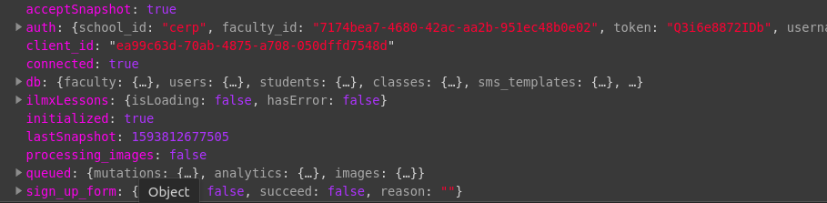
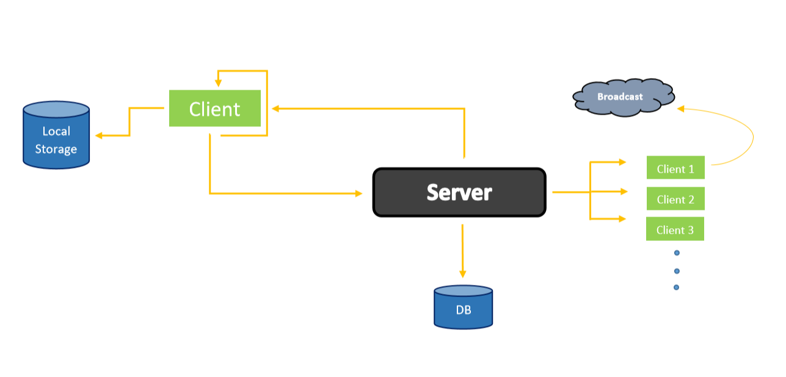
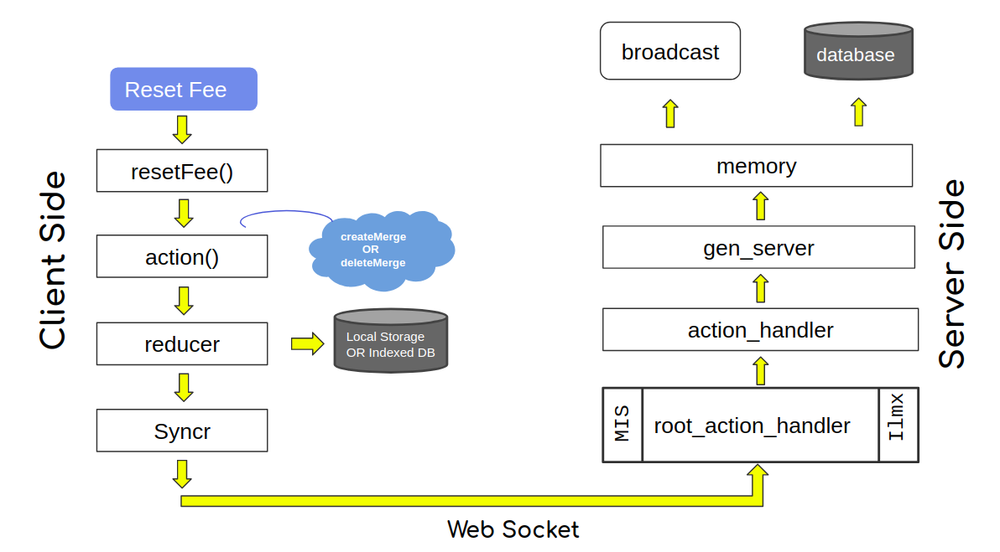
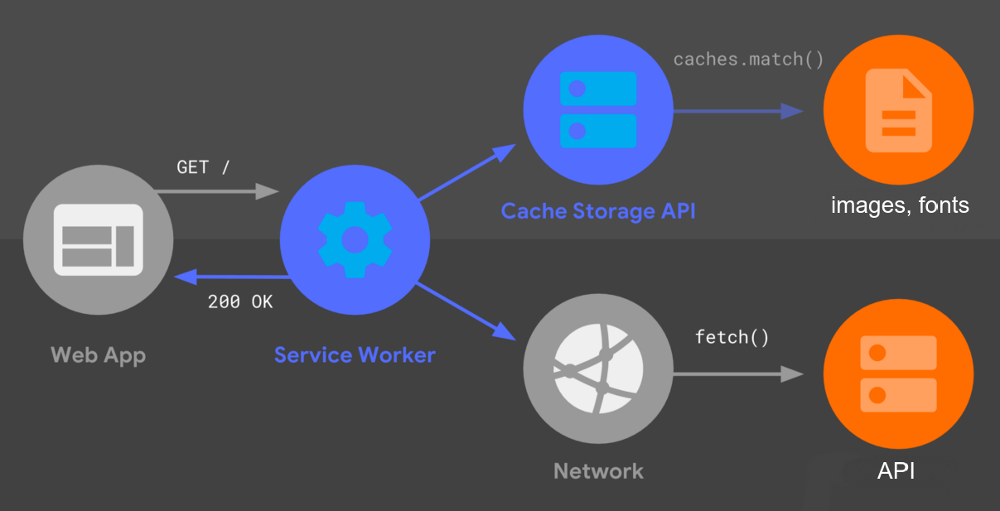
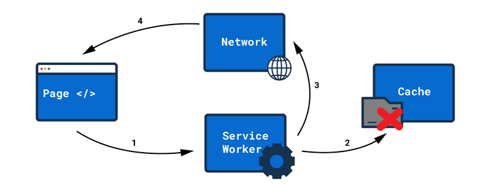

# Intro to LABS projects

In this markdown, you will learn about the technologies and architecture of some of `Labs` projects. You can find all the projects at [CERP Github](https://github.com/cerp) organization.

## Table of Content

- [Technologies](#technologies)
- [Tools We Built](#tools-we-built)
- [Projects Overview](#projects-overview)
  - [Actions](#actions)
    - [Core Actions](#core-actions)
  - [Async Actions](#async-actions)
- [Abstract view of Syncing](#abstract-view-of-syncing)
  - [Broadcasting](#broadcasting)
- [What happen when Action fired](#what-happen-when-action-fired)
- [Service Worker in MISchool](#service-worker-in-mischool)
  - [Abstract workflow of SW](#abstract-workflow-of-sw)
  - [Check if an update is available](#check-if-an-update-is-available)
- [Code Formatting and Linting](#code-formatting-and-linting)

## Technologies

We're building system using latest technologies, here's the list but we're not limited to them:

- **Frontend**

  - Javascript
  - Typescript
  - ReactJS + Redux
  - MaterialUI

- **Backend**

  - Elixir
  - Postgres

- **Platform**

  - Google Cloud Platform
  - Docker
  - Kubernetes

## Tool We Built

Here are some tools that we build which are currently used in most of our projects

- **Syncr**

  Make `asynchronous` requests to a server over WebSocket/Http connection

  [Learn More](./syncr.md)

- **Former**

  Handle `HTMLFormEvents` and mutate the state. Currently support `class` based components

  [Learn More](./former.md)
  
- **Dynamic**

  Provide useful tooling to manipulate the complex `Objects` (JS) and `Maps` (Elixir)

  [Learn More](./dynamic.md)

## Projects overview

At `Labs` we built [`MISchool`](https://mischool.pk) and [`IlmxExchange`](https://ilmexchange) as our starter products. Below are some stuff which we follow and reuse for every project that we already built and will building in future.

### **Actions**

To make change to `redux store` or to send payload to server, we divide actions into two category

These actions can be futher categorized into `Core` and `Simple` (based on core actions) actions. Let's see how core actions works

#### **Core Actions**
  
  For now we have `createMerges()` and `createDeletes()` actions which help to manipulate to complex deep object in `state`

- **`createMerges()`**

  createMerges() takes single argument of type `Merge[]` and return `void`. Here we're only looking at the prototype and usage of createMerges().

  **API**

  ```ts
  type Merge = {
    path: Array<string>
    value: any
  }
  createMerges(merges: Merge[]): void
  ```

  ```
  What does merge mean?
  Basically merge is an object which contains path and value. "Path" is composed of 
  complex deep object properties and "value" is any thing that we want to to store
  or update against the path.
  ```

  **Usage**

  Let's see createMerges in actions. Consider we have state like below

  `State A`

  ```ts
  "db": {
    "students": {
      [1]: {
        id: 1
        Name: "ABC",
        Gender: "M",
        "attendance": {}
      }
    }
  }
  ```

  1st Merge: Let's add a single student entry to state, so we create a merge like

  ```ts
  // merge to create or update a student
  const student = {
    id: 2
    Name: "XYZ",
    Gender: "X",
    payments: {}
  }

  const merges = [
    {
      path: ["db", "students", student.id],
      value: student
    }
  ]

  dispatch(createMerges(merges))
  ```

  After the merge action, state changes from `A` => `B` with a new student of `id:2`

  `State B`

  ```ts
  "db": {
    "students": {
      [1]: {
        id: 1
        Name: "ABC",
        Gender: "M",
        "attendance": {}
      },
      [2]: {
        id: 2
        Name: "XYZ",
        Gender: "M",
        "attendance": {}
      }
    }
  }
  ```

  2nd Merge: Let's add an `attendance` entry against a student (deep object), so we create a merge like

  ```ts
  // merge to create or update a student
  const student_id = 2
  const attendance = {
    date: "04-07-2020",
    status: "PRESENT",
    time: 1593806556000
  }

  const merges = [
    {
      path: ["db", "students", student_id, "attendance", attendance.date],
      value: attendance
    }
  ]

  dispatch(createMerges(merges))
  ```

  After the 2nd merge action, state changes from `B` => `C` with an attendance entry of student `id:2`

  `State C`

  ```ts
  "db": {
    "students": {
      [1]: {
        id: 1
        Name: "ABC",
        Gender: "M",
        "attendance": {}
      },
      [2]: {
        id: 2
        Name: "XYZ",
        Gender: "M",
        "attendance": {
          ["04-07-2020"]: {
            date: "04-07-2020",
            status: "PRESENT",
            time: 1593806556000
          }
        }
      }
    }
  }
  ```

- **`createDeletes()`**

  createDeletes() takes single argument of type `Delete[]` and return `void`. Here we're only looking at the prototype and usage of createDeletes().

  **API**

  ```ts
  type Delete = {
    path: Array<string>
  }
  createDeletes(deletes: Delete[]): void
  ```

  **Usage**

  1st Delete: Let's say we want to delete a student of `id: 1`, so we create a delete like

  ```ts
  const student_id = 1
  const deletes = [
    {
      path: ["db", "students", student_id]
    }
  ]
  dispatch(createDeletes(deletes))
  ```

  After a `createDeletes()` action, state changes from `C` => `D`, deleted student with `id:1`

  `State D`

  ```ts
    "db": {
      "students": {
        [2]: {
          id: 2
          Name: "XYZ",
          Gender: "M",
        "attendance": {
            ["04-07-2020"]: {
              date: "04-07-2020",
              status: "PRESENT",
              time: 1593806556000
            }
          }
        }
      }
    }
  ```

#### **`Async` Actions**

`async` actions help to send data to server using `Syncr`.

How a state manipulated by createMerges() or createDeletes encoded as an action and send to server. Let's see with createDeletes() in below steps. Assuming that we're working on `MISchool`

- `Step 1`: Dispatch createDeletes()

  ```ts
  const student_id = 1
  const delete = [
    {
      path: ["db", "students", student_id]
    }
  ]
  dispatch(createDeletes(delete))
  ```

- `Step-2`: Prepare merges as an action for server (in `createDeletes()`)

  ```ts
  const new_deletes = deletes.reduce((agg, curr) => ({
    ...agg,
    [curr.path.join(',')]: {
      action: {
        type: "DELETE",
        path: curr.path.map(p => p === undefined ? "" : p),
        value: 1 // what's the reason behind this?
      },
      date: new Date().getTime()
    }
  }), {})

  const state = getState()
  const rationalized_deletes = getRationalizedQueuePayload(new_deletes, "mutations", state)
  ```

- `Step-3`: Rationalize `state.queued` items with new delete mutations (in `getRationalizedQueuePayload()`)

  In this step, we're making sure, if there's anything else in queue(not send to server before), merge them together
  and send to server if `state.connected === true`

  ```ts
  // we're mainly dealing with three types of payload, deletes, merges fall in "mutations"
  type QueuedType = "mutations" | "images" | "analytics"
  type Queued = { mutataions: {}; analytics: {}, images:{}}
  getRationalizedQueuePayload = (payload: any, key: QueuedType, state: Queued) => {
    return {
      ...state.queued,
      images: {},
      [key]: {
        ...state.queued[key],
        ...payload
      }
    }
  }
  ```

  Here's what `RootReducerState` looks like

  

- `Step-4`: Send payload to server using `Syncr`

  ```ts
    const state = getState()
    syncr.send({
      type: SYNC,
      school_id: state.auth.school_id,
      client_type: client_type,
      lastSnapshot: state.lastSnapshot,
      payload
    })
  ```

## Abstract view of Syncing

To achieve `real-time` functionality in `MISchool` and `IlmExchange`, syncing played an import role. In the following diagram, it's an abstract view of how does syncing happen among the connected clients.



### Broadcasting

> In progress

## What happen when Action Fired

Let's say we want to reset fees for student in `MISchool`, following diagram shows what happen behind the scene when we press `reset fee` button.



## Service Worker in MISchool

Service worker allows you to support `offline` experiences, giving engineers and developers `end-to-end` control over the user’s interactions with the app. A service worker enables you to run Javascript before a page even exists, makes your site faster, and allows you to display content even if there is `no internet` connection. A few properties of service worker are:

- Runs in its own `global` script context
- Is not directly tied to any particular page
- Cannot access the DOM
- Is event-driven (it’s terminated when it’s not in use and run again when needed)
- Is `HTTPS` only

### Abstract Workflow of SW



For MISchool, we're using [`WorkBox`](https://developers.google.com/web/tools/workbox), a high-level set of libraries. It provides a solid foundation for any service worker's `caching`, `routing`, and `response` generation logic. Currently we're intercepting follow URLs with image caching (using `CacheFirst`) to support `MISchool` offline-first user experience.

```js
  workbox.routing.registerRoute(
    ({ url, event }) => {
      const match = url.host === "storage.googleapis.com" ||
        url.host === "fonts.googleapis.com" ||
        url.host === "googleapis.com" ||
        url.host === "www.googleapis.com"
      return match
    },
    // fetch from cache, but also fetch from network and update cache
    new workbox.strategies.CacheFirst({
      cacheName: 'images',
      plugins: [
        new workbox.expiration.Plugin({
          maxAgeSeconds: 60 * 60 * 24 * 30 // 30 days,
          purgeOnQuotaError: true
        })
      ]
    })
  )
```

### Check if an update is available

For `MISchool` we're adopting `CacheFirst` (fetch from cache, but also fetch from network and update cache) strategy. We can hook into `onupdatefound` function on the registered Service Worker. Even though we can cache tons of files, the Service Worker only checks the `hash` of registered service-worker.js. If that file has only `1 little change` in it, it will be treated as a new version.
Here's simple demonstration of Cache First strategy:



<p style="text-align:center;">The cache access failed and the Service Worker uses the network as a fallback.</p>

## Code Formatting + Linting

For code formatting and liting we use `ESLint` for Typescript for frontends
